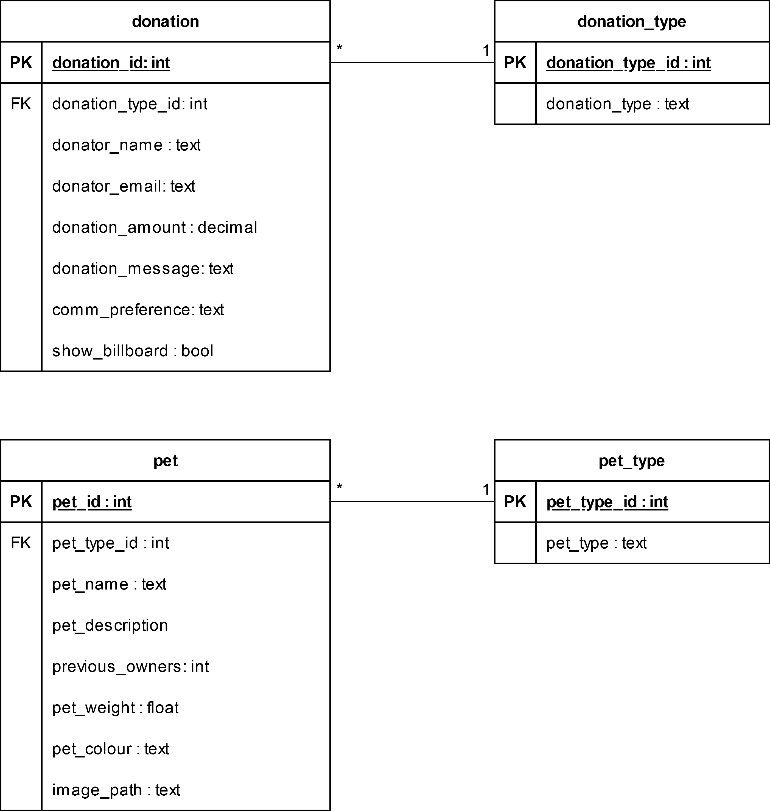

---
title: "IS1S484 - Designing and Implementing Interactive Systems - Design Brief"
author: [Jake Real - 23056792]
date: "13/12/2024"
toc-own-page: true
titlepage: true
table-use-row-colors: true
bibliography: "references.bib"
csl: "university-of-south-wales-harvard.csl"
nocite: |
...

# Designing and Implementing Interactive Systems Design Brief

## Design Brief

### The Objectives

### The Target Audience

### Personality and Tone



### Persuasive Tactics

### Single Minded Message

## Supporting Material

### Website URL

[Website URL](localhost:8080)

### Code Listings

The entire site is PHP,

#### index.php

```php
<?php

  use data\database;

  require_once __DIR__ . "/data/database.php";
  require_once __DIR__ . "/config/config.php";
  //  Require classes for session_start to avoid __PHP_Incomplete_Class
  require_once __DIR__ . "/models/pet.php";
  require_once __DIR__ . "/models/donation.php";

  session_start();
  $request = parse_url($_SERVER["REQUEST_URI"], PHP_URL_PATH);
  $db = new database(DB_HOST, DB_NAME, DB_PORT, DB_USER, DB_PASS, DB_SOCK);
  // Routing
  switch ($request) {
    case "":
    case "/":
      $view = __DIR__ . "/views/home.php";
      break;
    case "/donate":
      $view = __DIR__ . "/views/donate.php";
      break;
    case "/pets":
      $view = __DIR__ . "/views/pets.php";
      break;
    case "/contact-us":
      $view = __DIR__ . "/views/contact-us.php";
      break;
    case "/about-us":
      $view = __DIR__ . "/views/about-us.php";
      break;
    case "/news":
      $view = __DIR__ . "/views/news.php";
      break;
    case "/donation/confirm":
      $view = __DIR__ . "/views/donate-confirm.php";
      break;
    case "/donation/submitted":
      $view = __DIR__ . "/views/donate-submitted.php";
      break;
    case "/supporters/signin":
      $view = __DIR__ . "/views/supporters-signin.php";
      break;
    case "/supporters/home":
      $view = __DIR__ . "/views/supporters-home.php";
      break;
    case "/supporters/update":
      $view = __DIR__ . "/views/supporters-update-details.php";
      break;
    case "/supporters/update-submit":
      $view = __DIR__ . "/views/supporters-update-details-submitted.php";
      break;
    case "/supporters/signout":
      // Unset authentication
      unset($_SESSION["supporter_details"]);
      header("location:/");
      // Redirect to home
      break;
    default:
      header("location:/404");
      http_response_code(404);
      $view = __DIR__ . "/views/404.php";
      break;
  }
?>
<!DOCTYPE html>
<html lang="en">
  <?php require $view; ?>
</html>
```

#### home.php

```php
<?php
  /**
   * Included from index.php
   * @var database $db
   */

  use data\database;

  $title = "Preloved Pets - Home";
  include __DIR__ . "/../private/head.php";
?>
<body>
  <?php include __DIR__ . "/../private/header.php"; ?>
  <div class="main-content">
    <main>
      <div class="sideways-banner">
        <div class="sideways-banner-text">
          <h1 class="main-title">Donate to give pets without owners a new family</h1>
          <p class="main-title-subtitle">
            Monthly donors get an exclusive newsletter and club area!
          </p>
          <a href="/donate" class="anchor-button large-anchor-button">Donate today</a>
        </div>
        <div class="sideways-banner-img">
          
        </div>
      </div>
      <div class="sideways-banner sideways-banner-reverse">
        <div class="sideways-banner-text">
          <h2 class="secondary-title">
            We are a local charity that finds new, loving families for pets after their owners have died.
          </h2>
          <p class="main-title-subtitle">We currently accept cats, dogs, and rodents.</p>
          <a href="/about-us" class="anchor-button large-anchor-button grey-anchor">About us</a>
        </div>
        <div class="sideways-banner-img">
          
        </div>
      </div>
      <div class="sideways-banner">
        <div class="sideways-banner-text">
          <h2 class="secondary-title">Help us keep reptiles and fish</h2>
          <p class="main-title-subtitle">
            With <span class="bold-text">your</span> help, we want to expand to housing rodents, reptiles and fish in
            need.
          </p>
          <a href="/donate" class="anchor-button large-anchor-button">Donate to our goal</a>
        </div>
        <div class="sideways-banner-img">
          
        </div>
      </div>
      <div>
        <h2 class="secondary-title">Latest News</h2>
        <div class="adjacent-articles">
          <a href="/news" class="adjacent-article">
            <div class="adjacent-article-title">
              <h3>Large trust donation</h3>
              
            </div>
            <p>We have received a £2,000 donation from a local charity trust to help continue housing more pets.</p>
          </a>
          <a href="/news" class="adjacent-article">
            <div class="adjacent-article-title">
              <h3>Update on reptile housing goal</h3>
              
            </div>
            <p>Our reptile housing goal has progressed to 50% completion due to all of your support.</p>
          </a>
          <a href="/news" class="adjacent-article">
            <div class="adjacent-article-title">
              <h3>New pet area</h3>
              
            </div>
            <p>
              Due to your donations, we have installed a new internal pet area. This allows our staff to entertain
              housed cats and dogs during bad, rainy conditions
            </p>
          </a>
        </div>
      </div>
    </main>
  </div>
  <?php include __DIR__ . "/../private/footer.php"; ?>
</body>
```

<!-- TODO: Insert code listings at end -->

### Images

Images used:

- Preloved Pets logo [@AnimalShelterVector]
  - CC0
- Contact us
  - X icon [@simpleiconscontributorsSimpleIcons]
    - CCO
  - Instagram icon [@simpleiconscontributorsSimpleIcons]
    - CC0
  - YouTube icon [@simpleiconscontributorsSimpleIcons]
    - CC0
  - Facebook icon [@simpleiconscontributorsSimpleIcons]
    - CC0
- Pets page
  - Gwen image [@falconerShelteringTimeCoronavirus]
  - Lulu image [@kreuzschnabelEnglishDogSitting2016]
    - Free Art License 1.3
  - Cat image [@operationkindnessJuneNationalAdopt2020]
  - Rodent image [@PhotoNikolettEmmert2024]
    - Pexels licence
      - All photos and videos on Pexels are free to use.
- Home
  - Dog image [@pxherePxhereImage934965]
    - CC0
  - Staff holding cat [@jwdesignCatAnimalShelter2020]
  - Fish [@tdesignsGoldfishLionHead2017]
    - Pixababy licence
      - Use Content for free
- News:
  - News article [@devaprasadFillingBankCheque2020]
    - CC0
  - News article [@mcleodHowCarePet24]
  - News article [@francisIndoorDogParks2022]
- About us
  - Cat in about us [@liveseyFreeStockPhoto]
    - CC0
  - Our founder [@tan4ikkVetDogCat]
    - Adobe Standard licence
      - Include the asset in email marketing, mobile advertising, or a broadcast or digital program if the expected number of viewers is fewer than 500,000.
      - Post the asset to a website or social media site with no limitation on views.
  - Our staff [@andresrDogVetStock2014]

### Bibliography and Usages
