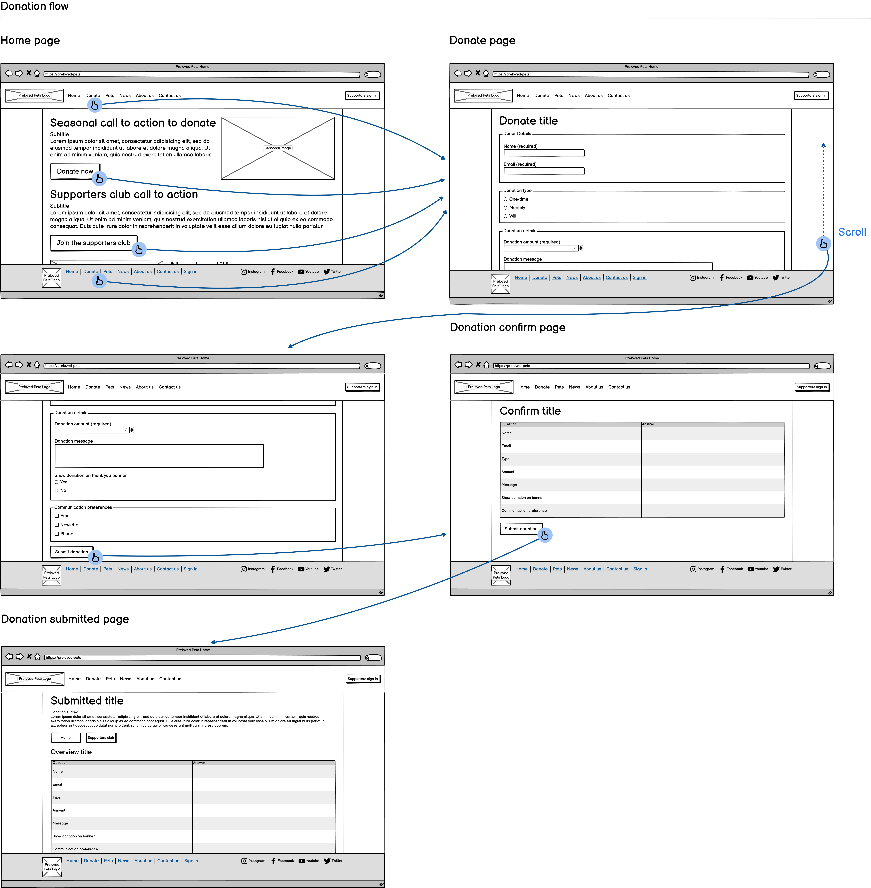
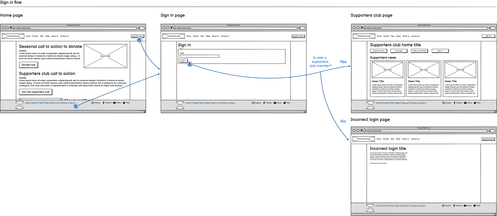
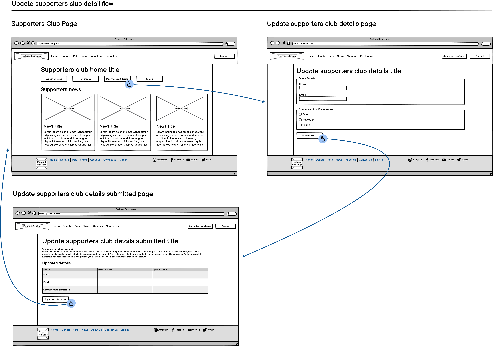

---
title: "IS1S484 - Designing and Implementing Interactive Systems - Design Brief"
author: [Jake Real - 23056792]
date: "13/12/2024"
lang: "en"
titlepage: true
toc-own-page: true
table-use-row-colors: true
colorlinks: true
bibliography: "references.bib"
csl: "university-of-south-wales-harvard.csl"
nocite: |
...

# Designing and Implementing Interactive Systems Design Brief

## Design Brief

### The Objectives

### The Target Audience

### Personality and Tone

### Wireflows

#### Donation wireflows

Desktop,



Mobile,


#### Adopt pet flow

Desktop,


Mobile,


#### Sign in flow

Desktop,



Mobile,


#### Update supporter account details flow

Desktop,



Mobile,


### Persuasive Tactics

### Single Minded Message

## Supporting Material

### Website URL

[Website URL](localhost:8080)

### PHP Page Listing

The entire site is PHP; therefore, the shown code listings are PHP-heavy files.

`index.php`,

```php
<?php

  use data\database;

  require_once __DIR__ . "/data/database.php";
  require_once __DIR__ . "/config/config.php";
  //  Require classes for session_start to avoid __PHP_Incomplete_Class
  require_once __DIR__ . "/models/pet.php";
  require_once __DIR__ . "/models/donation.php";

  session_start();
  $request = parse_url($_SERVER["REQUEST_URI"], PHP_URL_PATH);
  $db = new database(DB_HOST, DB_NAME, DB_PORT, DB_USER, DB_PASS, DB_SOCK);
  // Routing
  switch ($request) {
    case "":
    case "/":
      $view = __DIR__ . "/views/home.php";
      break;
    case "/donate":
      $view = __DIR__ . "/views/donate.php";
      break;
    case "/pets":
      $view = __DIR__ . "/views/pets.php";
      break;
    case "/contact-us":
      $view = __DIR__ . "/views/contact-us.php";
      break;
    case "/about-us":
      $view = __DIR__ . "/views/about-us.php";
      break;
    case "/news":
      $view = __DIR__ . "/views/news.php";
      break;
    case "/donation/confirm":
      $view = __DIR__ . "/views/donate-confirm.php";
      break;
    case "/donation/submitted":
      $view = __DIR__ . "/views/donate-submitted.php";
      break;
    case "/supporters/signin":
      $view = __DIR__ . "/views/supporters-signin.php";
      break;
    case "/supporters/home":
      $view = __DIR__ . "/views/supporters-home.php";
      break;
    case "/supporters/update":
      $view = __DIR__ . "/views/supporters-update-details.php";
      break;
    case "/supporters/update-submit":
      $view = __DIR__ . "/views/supporters-update-details-submitted.php";
      break;
    case "/supporters/signout":
      // Unset authentication
      unset($_SESSION["supporter_details"]);
      header("location:/");
      // Redirect to home
      break;
    default:
      header("location:/404");
      http_response_code(404);
      $view = __DIR__ . "/views/404.php";
      break;
  }
?>
<!DOCTYPE html>
<html lang="en">
  <?php require $view; ?>
</html>

```

`config.php`,

```php
<?php
  const DB_HOST = "db";
  const DB_PORT = 3306;
  const DB_NAME = "mysql";
  const DB_USER = "root";
  const DB_PASS = "admin";
  const DB_SOCK = "/var/run/mysqld/mysqld.sock";
```

`database.php`,

```php
<?php
  declare(strict_types=1);

  namespace data;

  use mysqli;

  class database
  {
    private mysqli $conn;
    private string $host;
    private int $port;
    private string $databaseName;
    private string $user;
    private string $password;
    private string $sock;

    public function __construct(string $host, string $name, int $port, string $user, string $password, string $sock)
    {
      $this->host = $host;
      $this->databaseName = $name;
      $this->port = $port;
      $this->user = $user;
      $this->password = $password;
      $this->sock = $sock;
    }

    public function getConn(): mysqli
    {
      if (isset($this->conn)) {
        return $this->conn;
      }

      $this->conn = new mysqli($this->host, $this->user, $this->password, $this->databaseName, $this->port, $this->sock);
      if ($this->conn->connect_error) {
        exit("Failed to connect to mysql database {$this->conn->connect_error}");
      }
      $this->conn->set_charset("utf8mb4");
      return $this->conn;
    }
  }
```

`donation_repo.php`,

```php
<?php
  declare(strict_types=1);

  namespace data;

  use model\donation;

  require_once __DIR__ . "/database.php";
  require_once __DIR__ . "/../models/donation.php";

  class donation_repo
  {
    public database $database;

    public function __construct(database $database)
    {
      $this->database = $database;
    }

    /**
     * @return array<donation>
     */
    public function get_banner_donations(): array
    {
      $donation_types = $this->get_donation_types();
      $conn = $this->database->getConn();
      $result = $conn->query("
        SELECT donation_id, 
               donation_type_id, 
               donator_name, 
               donation_email, 
               donation_amount, 
               donation_message,
               comm_preference,
               show_billboard
        FROM public.donation
        WHERE show_billboard = 1    
        LIMIT 20"
      );
      $rows = $result->fetch_all(MYSQLI_ASSOC);
      /** @var array<donation> $donations */
      $donations = array();
      foreach ($rows as $row) {
        $new_donation = new donation(
          intval($row["donation_id"]),
          $donation_types[intval($row["donation_type_id"])],
          $row["donator_name"],
          $row["donation_email"],
          floatval($row["donation_amount"]),
          $row["donation_message"],
          $row["comm_preference"],
          boolval($row["show_billboard"])
        );
        $donations[] = $new_donation;
      }
      return $donations;
    }

    /**
     * @return array<int,string>
     */
    public function get_donation_types(): array
    {
      $conn = $this->database->getConn();
      $result = $conn->query("
        SELECT donation_type_id, donation_type
        FROM public.donation_type"
      );
      $rows = $result->fetch_all(MYSQLI_ASSOC);
      /** @var array<int, string> $donation_types */
      $donation_types = array();
      foreach ($rows as $row) {
        $donation_types[$row["donation_type_id"]] = $row["donation_type"];
      }
      return $donation_types;
    }

    public function add_donation(donation $donation): bool
    {
      $conn = $this->database->getConn();
      switch ($donation->donationType) {
        case "monthly":
          $donation_type_id = 1;
          break;
        case "will":
          $donation_type_id = 3;
          break;
        case "one-time":
        default:
          $donation_type_id = 2;
          break;
      }

      $sql = $conn->prepare("
        INSERT INTO public.donation
            (donation_type_id, donator_name, donation_email, donation_amount, donation_message, comm_preference, show_billboard)
        VALUES (?, ?, ?, ?, ?, ?, ?);"
      );
      // Convert to int before passing to database
      $show_billboard_int = intval($donation->showBillboard);
      $sql->bind_param("issdssi",
        $donation_type_id,
        $donation->donationName,
        $donation->donationEmail,
        $donation->donationAmount,
        $donation->donationMessage,
        $donation->commPreference,
        $show_billboard_int
      );

      return $sql->execute();
    }

    /**
     * @param string $email
     * @return donation|null
     */
    public function in_supporters_club(string $email): ?donation
    {
      $conn = $this->database->getConn();
      $sql = $conn->prepare("
        SELECT donation_id, 
               donation_type_id, 
               donator_name,
               donation_email, 
               donation_amount, 
               donation_message,
               comm_preference,
               show_billboard
        FROM public.donation WHERE donation_email = ?"
      );
      $sql->bind_param("s", $email);
      $sql->execute();

      $result = $sql->get_result();
      $rows = $result->fetch_all(MYSQLI_ASSOC);

      if (count($rows) < 1) {
        return null;
      }

      $row = $rows[0];
      return new donation(
        intval($row["donation_id"]),
        $row["donation_type_id"] == 1 ? "monthly" : "one_off",
        $row["donator_name"],
        $row["donation_email"],
        floatval($row["donation_amount"]),
        $row["donation_message"],
        $row["comm_preference"],
        boolval($row["show_billboard"])
      );
    }

    public function update_donation(int $donation_id, string $donation_name, string $donation_email, string $comm_preference): bool
    {
      $conn = $this->database->getConn();
      $sql = $conn->prepare("
        UPDATE public.donation SET 
          donator_name = ?,
          donation_email = ?,
          comm_preference = ?
        WHERE donation_id = ?"
      );
      $sql->bind_param("sssi", $donation_name, $donation_email, $comm_preference, $donation_id);
      return $sql->execute();
    }
  }
```

`pet_repo.php`,

```php
<?php
  declare(strict_types=1);

  namespace data;

  use model\pet;

  require_once __DIR__ . "/database.php";
  require_once __DIR__ . "/../models/pet.php";

  class pet_repo
  {
    public database $database;

    /**
     * @param database $database
     */
    public function __construct(database $database)
    {
      $this->database = $database;
    }

    /**
     * @return array<pet>
     */
    public function get_pets(): array
    {
      $pet_types = $this->get_pet_types();
      $conn = $this->database->getConn();
      $result = $conn->query("
        SELECT pet_id,
               pet_type_id,
               pet_name,
               pet_description,
               previous_owners,
               pet_weight,
               pet_colour,
               image_path
        FROM public.pet
        LIMIT 20;"
      );
      $rows = $result->fetch_all(MYSQLI_ASSOC);
      /** @var array<pet> $pets */
      $pets = array();
      foreach ($rows as $row) {
        $new_pet = new pet(
          intval($row["pet_id"]),
          $pet_types[intval($row["pet_type_id"])],
          $row["pet_name"],
          $row["pet_description"],
          intval($row["previous_owners"]),
          floatval($row["pet_weight"]),
          $row["pet_colour"],
          $row["image_path"]
        );
        $pets[] = $new_pet;
      }
      return $pets;
    }

    /**
     * @return array<int, string>
     */
    private function get_pet_types(): array
    {
      $conn = $this->database->getConn();
      $result = $conn->query("
        SELECT pet_type_id,
               pet_type
        FROM public.pet_type"
      );
      $rows = $result->fetch_all(MYSQLI_ASSOC);
      /** @var array<int, string> $pet_types */
      $pet_types = array();
      foreach ($rows as $row) {
        $pet_types[$row["pet_type_id"]] = $row["pet_type"];
      }
      return $pet_types;
    }
  }
```

`donation_controller.php`,

```php
<?php
  declare(strict_types=1);

  namespace controllers;

  require_once __DIR__ . "/../data/donation_repo.php";

  use data\database;
  use data\donation_repo;
  use Exception;
  use model\donation;

  class donation_controller
  {
    private donation_repo $donation_repo;

    /**
     * @param database $db
     */
    public function __construct(database $db)
    {
      $this->donation_repo = new donation_repo($db);
    }

    function submit_donation(): bool
    {
      // Check that form data is in session storage
      if (!isset(
        $_SESSION["donation-type"],
        $_SESSION["donator-name"],
        $_SESSION["donator-email"],
        $_SESSION["donation-amount"],
        $_SESSION["donation-message"],
        $_SESSION["comm-preference"],
        $_SESSION["show-billboard"]
      )) {
        throw new Exception("Form data incomplete");
      }
      $new_donation = new donation(
        null,
        $_SESSION["donation-type"],
        $_SESSION["donator-name"],
        $_SESSION["donator-email"],
        floatval($_SESSION["donation-amount"]),
        $_SESSION["donation-message"],
        $_SESSION["comm-preference"],
        boolval(["show-billboard"])
      );
      return $this->donation_repo->add_donation($new_donation);
    }

    function is_supporters_member(string $email): ?donation
    {
      $in_supporters_club = $this->donation_repo->in_supporters_club($email);
      if (isset($in_supporters_club)) {
        $_SESSION["supporter_details"] = $in_supporters_club;
      }
      return $in_supporters_club;
    }

    function update_donation(int $donation_id, string $donation_name, string $donation_email, string $comm_preference): bool
    {
      return $this->donation_repo->update_donation($donation_id, $donation_name, $donation_email, $comm_preference);
    }
  }
```

### Media Sources

Fonts used:

- Lilita One Font [@montoreanoLilitaOneFont]

Banner and footer:

- Preloved Pets logo [@AnimalShelterVector]
  - CC0
  
Contact us page and footer:

- X icon [@simpleiconscontributorsSimpleIcons]
  - CCO
- Instagram icon [@simpleiconscontributorsSimpleIcons]
  - CC0
- YouTube icon [@simpleiconscontributorsSimpleIcons]
  - CC0
- Facebook icon [@simpleiconscontributorsSimpleIcons]
  - CC0
  
Embedded elements used in contact us:

- Google Maps iframe [@googleGoogleMaps]
  - SIL Open Font License (OFL)

Pets page:

- Gwen image [@falconerShelteringTimeCoronavirus]
- Lulu image [@kreuzschnabelEnglishDogSitting2016]
  - Free Art License 1.3
- Sid image [@operationkindnessJuneNationalAdopt2020]
- Rodent image [@PhotoNikolettEmmert2024]
  - Pexels licence
    - All photos and videos on Pexels are free to use.

Home page:

- Dog image [@pxherePxhereImage934965]
  - CC0
- Staff holding cat [@jwdesignCatAnimalShelter2020]
- Fish [@tdesignsGoldfishLionHead2017]
  - Pixababy licence
    - Use Content for free

News page:

- News article [@devaprasadFillingBankCheque2020]
  - CC0
- News article [@mcleodHowCarePet24]
- News article [@francisIndoorDogParks2022]

About us page:

- Cat in about us [@liveseyFreeStockPhoto]
  - CC0
- Our founder [@tan4ikkVetDogCat]
  - Adobe Standard licence
    - Include the asset in email marketing, mobile advertising, or a broadcast
        or digital program if the expected number of viewers is fewer than
        500,000.
    - Post the asset to a website or social media site with no limitation on
      views.
- Our staff [@andresrDogVetStock2014]
  
### Validation Report

<!-- TODO: Add views -->

#### Cascading Style Sheets

`reset.css`,

```css
/*
 * CSS Reset: Prevents browsers displaying their in-built styles. This ensures
 * the website looks the same over different web engines
 */

/* Box sizing rules */
*,
*::before,
*::after {
  box-sizing: border-box;
}

/* Remove default margins */
* {
  margin: 0;
}

/* Text rendering, line height accessibility */
body {
  line-height: 1.5;
  -webkit-font-smoothing: antialiased;
}

/* Prevent font size inflation */
html {
  -moz-text-size-adjust: none;
  -webkit-text-size-adjust: none;
  text-size-adjust: none;
}

/* Remove default margin in favour of better control in authored CSS */
body, h1, h2, h3, h4, p,
figure, blockquote, dl, dd {
  margin-block-end: 0;
}

/* Remove list styles on ul, ol elements with a list role, which suggests default
 * styling will be removed
 */
ul[role='list'],
ol[role='list'] {
  list-style: none;
}

/* Set core body defaults
 * body {
 *   min-height: 100vh;
 *   line-height: 1.5;
 * }
 */

/* Set shorter line heights on headings and interactive elements
 * h1, h2, h3, h4,
 * button, input, label {
 *   line-height: 1.1;
 * }
 */

/* Balance text wrapping on headings */
h1, h2,
h3, h4 {
  text-wrap: balance;
}

/* Improve line wrapping on normal text */
p {
  text-wrap: pretty;
}

/* Avoid text overflows */
p, h1, h2, h3, h4, h5, h6 {
  overflow-wrap: break-word;
}

/* A elements that don't have a class get default styles */
/*a:not([class]) {*/
/*    text-decoration-skip-ink: auto;*/
/*    color: currentColor;*/
/*}*/

/* Inherit fonts for inputs and buttons */
input, button,
textarea, select {
  font-family: inherit;
  font-size: inherit;
}

/* Remove fieldset border */
fieldset {
  border-width: 0;
  padding: 0;
}

/* Make sure textareas without a rows attribute are not tiny */
textarea:not([rows]) {
  min-height: 10em;
}

/* Improve media defaults */
img, picture, video, canvas, svg {
  display: block;
  max-width: 100%;
}
```


`main.css`,

```css
/* Colours
 * Define colour variables to reuse across website
 */
:root {
  --main-bg-colour: #fcfcfc;
  --sec-bg-colour: #e8e8e8;
  --grey: #d7d7d7;
  --mid-grey: #969696;
  --focus: #212121;
  --timberwolf: #dad7cdff;
  --sage: #a3b18aff;
  --fern-green: #588157ff;
  --hunter-green: #3a5a40ff;
  --brunswick-green: #344e41ff;
  --link: #1d70b8;
  --link-hov: #003078;
}

/* Custom fonts used */
@font-face {
  font-family: 'Lilita One';
  font-style: normal;
  font-weight: 400;
  font-display: swap;
  src: url(LilitaOne-Regular.ttf);
}

/* Standard Components */
/* Form components */
input,
textarea {
  display: block;
  background-color: var(--grey);
  border: 2px solid var(--mid-grey);
  padding: 0.4rem;
  border-radius: 5px;
}

input[type=radio],
input[type=checkbox] {
  display: inline-block;
  border: 2px solid black;
  color: black;
}

input[type=radio]:focus-visible {
  outline: 2px solid black;
  box-shadow: none;
}

button {
  background-color: var(--sec-bg-colour);
  border: 2px solid var(--grey);
  padding: 0.4rem 0.8rem;
  border-radius: 5px;
}

button[type=submit] {
  color: black;
  background-color: var(--sage);
  border-color: var(--focus);
}

button:hover,
input:hover {
  filter: brightness(0.9);
}

button:active {
  background-color: var(--fern-green);
  border: 2px solid var(--hunter-green);
  color: white;
}

button:focus-visible,
input:focus-visible,
textarea:focus-visible,
a:focus-visible {
  outline: 2px solid white;
  box-shadow: 0 0 0 5px var(--focus);
}

/* Form items */
form {
  background-color: var(--sec-bg-colour);
  padding: 1.5rem 1.5rem;
}

fieldset legend {
  font-weight: 600;
}

/* Transparent form for single input purposes */
form.hidden-form {
  background-color: transparent;
  padding: 0;
  margin: 1rem 0;
}

.form-required {
  color: darkred;
}

/* Anchor tags */
a:visited {
  color: #6a17b9;
}

a {
  color: var(--link);
}

a:hover {
  color: var(--link-hov);
  text-decoration-thickness: 2px;
}

/* Anchor tags that look like buttons */
a.anchor-button {
  display: inline-block;
  border: 2px solid var(--fern-green);
  padding: 0.15rem 0.8rem;
  border-radius: 5px;
  background-color: var(--brunswick-green);
  color: var(--grey);
}

a.large-anchor-button {
  padding: 0.5rem 1.6rem;
  font-size: 1.5rem;
  font-weight: 700;
  text-decoration-line: none;
}

a.grey-anchor {
  background-color: var(--timberwolf);
  color: var(--focus);
  border-color: var(--mid-grey);
}

a.grey-anchor:hover {
  filter: brightness(1.1);
}

/* Table components */
table {
  text-align: left;
  vertical-align: top;
  border: 2px solid var(--focus);
  border-collapse: collapse;
}

table caption {
  text-align: left;
  font-size: 1.2rem;
  font-weight: 700;
  margin-bottom: 0.5rem;
}

thead {
  background-color: var(--sage);
}

tbody {
  background-color: var(--sec-bg-colour);
}

th,
td {
  padding: 0.5rem;
  font-weight: 400;
  border: 2px solid var(--focus);
}

th[scope=row] {
  font-weight: 700;
}

/* Utility rules */
.hidden-text {
  display: none;
}

.bold-text {
  font-weight: bold;
}

.inset-text {
  border-left: 4px solid var(--grey);
  padding-left: 15px;
}

/* Add margin to standard text */
/* Using main avoids affecting CSS in header and footers */
main p,
main h2 {
  margin-bottom: 1rem;
}

/*
 * Layout of all pages
 */
html,
body {
  height: 100%;
}

body {
  background-color: var(--main-bg-colour);
  font-family: sans-serif;
  display: flex;
  flex-direction: column;
}

.main-content {
  display: flex;
  flex: 1;
  flex-direction: row;
  justify-content: center;
}

.main-content>main {
  margin: 2rem 0;
  /*flex: 1 0;*/
}

main h1 {
  margin-bottom: 1rem;
}

/* Header layout */
header.top-header {
  background-color: var(--hunter-green);
}

.header-content-wrapper {
  display: flex;
  flex-direction: row;
  justify-content: center;
  margin: 2rem 0;
}

.header-content {
  display: flex;
  flex-flow: row wrap;
  align-items: center;
  row-gap: 1rem;
}

/* Links on header */
.header-links {
  width: 100%;
  align-items: flex-end;
}

.header-logo a {
  display: flex;
  align-items: center;
  color: var(--sec-bg-colour);
  text-decoration-line: none;
  font-weight: 700;
  font-size: 1.5rem;
}

.nav-links {
  display: flex;
  flex-flow: row wrap;
  row-gap: 1rem;
  column-gap: 1.5rem;
  list-style: none;
  padding: 0;
}

/* Pushes links after to right side of header */
.right-nav-links {
  margin-right: auto;
}

.header-content a {
  color: var(--sec-bg-colour);
  text-decoration-line: none;
  font-weight: bold;
  font-size: 1.3rem;
}

.header-content a:hover,
.anchor-button:hover {
  filter: brightness(1.25);
}

/* Footer layout */
.footer-wrapper {
  display: flex;
  flex-direction: row;
  justify-content: center;
  border-top: 3px solid var(--sage);
  background-color: var(--hunter-green);
}

.footer-content {
  display: flex;
  flex-direction: row;
  column-gap: 1rem;
  margin: 1.5rem 0;
}

div.footer-content * {
  color: var(--sec-bg-colour);
}

.footer-content-logo {
  flex: 0 0 64px;
}

.footer-content-links>*:not(:last-child) {
  margin-right: auto;
}

.footer-content-links {
  display: flex;
  flex: 2 1 auto;
  flex-flow: row wrap;
  row-gap: 1.25rem
}

.social-media-link {
  display: flex;
  align-items: center;
  column-gap: 0.4rem;
}

/* Donation banner */
.donation-alerts {
  overflow: hidden;
  background-color: var(--sage);
  padding: 0.3rem 0;
}

/* Set donation banner text colour */
.donation-alerts * {
  color: var(--focus);
}

/* Donation form page */
.donation-form label {
  display: block;
}

.donation-form>*,
.donation-form fieldset>* {
  margin: 0.5rem 0;
}

.donation-form input,
.donation-form textarea {
  margin: 0.25rem 0;
}

.donation-form textarea {
  width: 14rem;
}

.donation-type {
  font-weight: normal;
}

/* Pets page */
ul.list-pets {
  display: flex;
  flex-flow: wrap row;
  justify-content: space-between;
  row-gap: 2rem;
  /*column-gap: 2rem;*/
  list-style: none;
  padding: 0;
}

ul.list-pets li {
  display: flex;
  flex-flow: nowrap column;
  max-width: calc(50% - 2rem);
  /*margin: 1rem;*/
  padding: 1rem;
  border: var(--focus) 2px solid;
}

ul.list-pets li>* {
  margin: 0.25rem 0;
}

ul.list-pets li>table {
  margin-bottom: 0.75rem;
}

ul.list-pets li>a.anchor-button {
  margin-top: auto;
}

.pet-title-image {
  display: flex;
  flex-flow: nowrap column-reverse;
  row-gap: 0.5rem;
}

.pet-title-image h2 {
  margin: 0;
}

.pet-details {
  background-color: transparent;
  width: 100%;
  padding: 0;
}

.pet-details tbody {
  background-color: transparent;
}

.pet-details th,
.pet-details td {
  width: 50%;
}

/* Contact us page */
.contact-us {
  margin: 1rem 0;
}

.contact-us>h2 {
  margin-bottom: 0.5rem;
}

.google-maps-embed {
  margin: 1rem 0;
}

.google-maps-embed iframe {
  max-width: 280px;
}

.google-maps-embed p {
  margin: 0.5rem 0;
}

/* About us page */
.about-us h3 {
  margin-bottom: 1rem;
}

.center-img {
  display: flex;
  justify-content: center;
  margin: 1rem;
  text-align: center;
}

/* News page */
.news-article {
  background-color: var(--sec-bg-colour);
  padding: 1.5rem;
  margin-bottom: 2rem;
}

.news-article-img {
  display: flex;
  justify-content: center;
}

.news-article-img img {
  width: 100%;
}

/* Home page */
.main-title {
  font-family: "Lilita One", serif;
  font-size: 3.5rem;
  text-transform: uppercase;
  color: var(--focus);
}

.main-title-subtitle {
  font-size: 1.5rem;
  color: var(--focus);
}

.secondary-title {
  font-family: "Lilita One", serif;
  font-size: 2.5rem;
  color: var(--focus);
}

/* Top to bottom banner */
.reverse-header-img {
  display: flex;
  flex-flow: column-reverse nowrap;
  row-gap: 1rem;
}

.top-banner-img {
  width: 50%;
}

/* Side to side banner */
.sideways-banner {
  display: flex;
  flex-flow: row wrap-reverse;
  margin-bottom: 3rem;
  column-gap: 2rem;
}

.sideways-banner-reverse {
  flex-direction: row-reverse;
}

.sideways-banner-text {
  width: calc(50% - 2rem);
  flex: 1 0 auto;
}

.sideways-banner-text>h1 {
  margin-bottom: 0.5rem;
}

.sideways-banner-text>p {
  margin-bottom: 2rem;
}

.sideways-banner-img {
  width: 100%
}

/* Side by side articles */
.adjacent-articles {
  display: flex;
  flex-flow: row wrap;
  column-gap: 2rem;
  row-gap: 2rem;
}

.adjacent-article-title {
  display: flex;
  flex-flow: column-reverse nowrap;
  row-gap: 0.5rem;
  margin-bottom: 1rem;
}

.adjacent-article {
  display: block;
  width: 100%;
  padding: 1rem;
  background-color: var(--sec-bg-colour);
}

.adjacent-article {
  color: black;
  text-decoration-line: none;
}

.adjacent-article:visited {
  color: inherit;
}

/*
 * Media query breakpoints for responsive design
 * Using the default bootstrap endpoint sizes as these are most common
 */

/* Extra small */
@media only screen and (max-width: 576px) {

  .main-content>main,
  .header-content,
  .footer-content {
    width: 90%;
  }

  ul.list-pets li {
    max-width: 100%;
  }

  .top-banner-img {
    width: 100%;
  }
}

/* Small */
@media screen and (min-width: 576px) {

  .main-content>main,
  .header-content,
  .footer-content {
    width: 80%;
  }

  .google-maps-embed iframe {
    max-width: 600px;
  }
}

/* Medium */
@media screen and (min-width: 768px) {

  .main-content>main,
  .header-content,
  .footer-content {
    width: 75%;
  }

  .sideways-banner-img {
    max-width: calc(50% - 2rem);
  }

  .adjacent-article {
    width: calc(33.33% - 2rem);
  }
}

/* Large */
@media screen and (min-width: 992px) {

  .main-content>main,
  .header-content,
  .footer-content {
    width: 70%;
  }
}

/* Extra Large */
@media screen and (min-width: 1200px) {

  .main-content>main,
  .header-content,
  .footer-content {
    width: 65%;
  }

  .news-article-img img {
    width: 50%;
  }
}

/* Extra extra large */
@media screen and (min-width: 1400px) {

  .main-content>main,
  .header-content,
  .footer-content {
    width: 60%;
  }
}
```


`donations.css`,

```css
/*
 * Animations for donation scrolling
 * Stored separately as it involves keyframes
 */

/* Scrolling donation text */
.scroll-text {
  text-align: right;
  animation: scroll-animation 30s linear infinite;
  animation-iteration-count: infinite;
  text-overflow: clip;
  overflow: visible;
  white-space: nowrap;
}

.scroll-text-donation:nth-child(odd) {
  margin-right: 3rem;
}

.scroll-text-donation:nth-child(even) {
  margin-right: 8rem;
}


@keyframes scroll-animation {
  from {
    transform: translateX(100%);
  }
  to {
    transform: translateX(-100%);
  }
}
```


### Cascading Style Sheets Explanation

The `reset.css` file aims overwrite default browser styles to a default,
unopinionated, neutral state. Different browsers have distinct presentation
defaults; Gecko (Firefox), Safari, and Chromium based browsers all present pages
differently, resulting in an inconsistent experience across browsers. Therefore,
a CSS reset style sheet is used to standardise the presentation across browser
families, providing a starting point for CSS styling [@mayerCSSToolsReset].
The CSS reset used is an edited combination of 2 style sheets,
'A Modern CSS Reset' [@comeauModernCSSReset2024] and 'A (more) Modern CSS Reset'
[-@bellMoreModernCSS2023]. Unnecessary rules were removed, comments were added,
and rules were modified.

In the `main.css`, first the root colours for the entire website are defined in
CSS variables. This allows easy changes to the site's colour scheme through
simple variable changes rather than replacing every colour declaration.

Furthermore, custom fonts used are defined at the root level. A single
open-source font called 'Lilita One' was used.

Then, the form component styles are defined. All form components are grey, with
a small circular radius. The focus style is replaced by a black or white outline
depending on the page background after following advice concerning focus
indicators [@soueidanGuideDesigningAccessible2021]. Notably, the CSS defines an
anchor tag that looks like a button to maintain semantic HTML with a intuitive
appearance.

The CSS layout was developed desktop-first and mobile-second. To achieve this,
6 width-based breakpoints were defined. For familiarity, Bootstrap's breakpoints
were used [@ottoBreakpoints2020]. Extra-small is below 576 pixels, small is to
768 pixels, medium is to 992 pixels, large is to 1200 pixels, and extra large is
to 1400 pixels, and extra extra large is over 1400 pixels. These breakpoints
vary the width of the main layout, and size and location of images.

The main page layout uses a Flexbox column display applied to a 100% height HTML
`body`. Three elements are within the Flexbox `body`, the header, a `div` for
the main content, and the footer. The `div` for the main content is set to grow,
pushing the footer to the bottom of the page. This achieves a typical header,
content, footer layout.

The `div` containing the main content is a Flexblox containing a single `main`
element. The Flexbox is a column based with center justified content, placing
all the content in the middle of the screen. The width of the center content
is changed by the breakpoint media queries.  Larger screen sizes use
approximately 65% width; this adds border left and right of the content. However,
smaller displays have 90% width, adding only a small amount of padding to
account for the small screen size.

Both the header and footer have similar columnar, center justified Flexboxes
with the same widths. This ensures that the header and footer content align
with the main content.

Pages have individual rules for their content.

The lower area of the banner uses its own style sheet called `supporters.css`.
The style sheet contains CSS animations for the scrolling donation. CSS
animations were used as the `marque` tag in favour of this method
[@mdnMarqueeElementHTML2024]. The animation scrolls infinitely, looping every
30 seconds.

### Reflection

Overall, the coursework went quite well. Despite never developing with PHP before,
the coursework went well. Various patterns such as routing, separation
of frontend and backend, and object-oriented programming were used, and the
codebase was clearly structured. This coursework provided a great opportunity
to learn PHP's installation, syntax, structure, and workflow. Moreover, database
connectivity was very successful. MySQL was very similar to other SQL databases
so my knowledge transferred well and PHP connected quite seamlessly aside from
finding the right SQL credentials. Throughout the coursework, CSS was a
strength due prior knowledge of Flexboxes, responsive design, and selectors.
During responsive testing, the layout behaved very well, even on the smallest
screen sizes, such as the IPhone 5 / SE. Unfortunately, the style sheet did grow
quite large; a smaller style sheet would have been preferable. Finally,
accessibility was a big focus during design and development. All colours on the
website are WCAG AA compliant, semantic HTML was used throughout, all images
have suitable alt tags, and all HTML and CSS is valid. On the other hand, one
of the biggest challenges encountered was addressing the inability to create
a dynamic website. JavaScript was not in the brief's scope; thus it was not
used at all in the project. However, JavaScript's addition would greatly expand
the capabilities of the site, especially in mobile accessibility. For example,
the large heading could be replaced by an expandable menu button, reducing
visual clutter. One of the biggest difficulties was creating example content
for the website; writing home page, and about us content in the correct tone
was strenuous. Furthermore, sourcing suitable images was quite challenging.
Many images had either unsuitable licences, or completely lacked one, and the
quality of the images was a weakness. Overall, the coursework was successful
and provided a great learning PHP learning opportunity; however, writing and
sourcing content for the website was difficult.

## Bibliography and Usages
